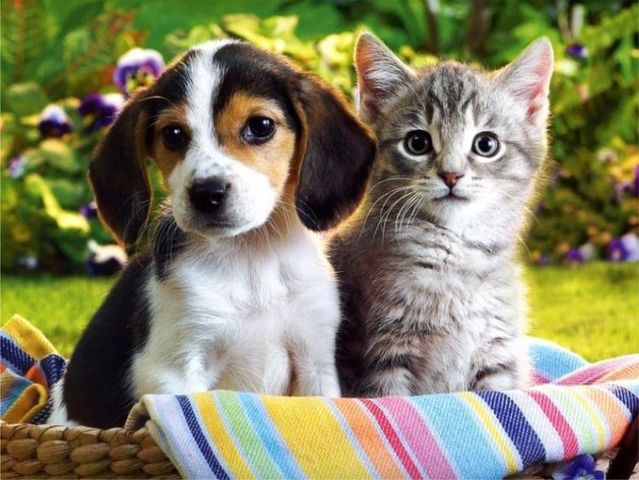

## Cat and Dog Image Classifier



### Project Description:

The Cat and Dog Image Classifier is a deep learning project that aims to classify images of cats and dogs using Convolutional Neural Networks (CNNs). The project is built with TensorFlow and Keras and deployed using FastApi, HTML ,CSS ans JS, allowing users to upload an image and receive predictions on whether the uploaded image contains a `cat` or a `dog`.

### About Me:

My name is Prem Gaikwad, and I am currently pursuing my Bachelor's degree in Electronics and Telecommunication Engineering at PICT. I am passionate about `Artificial Intelligence` and `Machine Learning`, with a particular interest in `Data Science` and `Analytics`. I love to learn by working on hands-on projects, and this Cat and Dog `Image Classifier` project is one such endeavor where I am learning about CNNs and image classification.

### Technologies and Libraries Used:

- TensorFlow
- Keras
- FastApi
- HTML, CSS & JS
- Google Colab

### Data Preprocessing:

`Data Link : https://www.kaggle.com/c/dogs-vs-cats`

The first step in the project is to download the dataset from the Kaggle competition using the Kaggle API. The downloaded zip files are then extracted to the appropriate folders. Next, the training images are organized into separate cat and dog folders, ensuring a structured dataset for model training.

### Model Training:

The model is trained using TensorFlow and Keras. The training images are preprocessed by resizing and rescaling to a standard image size of 80x80 pixels. Data augmentation techniques such as random flipping and rotation are applied to augment the training data and improve model generalization.

The CNN architecture consists of multiple convolutional layers, followed by max-pooling layers, which helps in feature extraction from the input images. The model is then flattened and connected to fully connected layers with ReLU activation functions. The output layer is a dense layer with softmax activation to predict the probability of the input image belonging to either a cat or a dog class.

The model is compiled with the Adam optimizer and sparse categorical cross-entropy loss. The training process is performed on a GPU to accelerate computation, and the model is evaluated on a validation dataset to monitor its performance.

### Image Prediction:

Once the model is trained, it is saved for future use. The Streamlit application allows users to upload an image through the file uploader. After uploading the image, the application performs the necessary preprocessing, resizes the image, and passes it to the trained model for prediction. The model predicts whether the uploaded image contains a cat or a dog, and the predicted class and confidence score are displayed to the user.

### Git Commands:

To clone the project repository, use the following Git command:

```
git clone https://github.com/Prem07a/Dog_Cat.git
```

### Installing Dependencies:

All the project dependencies are listed in the `requirements.txt` file. To install these dependencies, you can use the following command:

```
pip install -r requirements.txt
```

Make sure you have Python and pip installed on your system before running the above command.

```
Note: Download `kaggle.json` from kaggle api in-order to download data if it is not extracted properly (Move it to kaggle folder which is in data folder).
```
---

